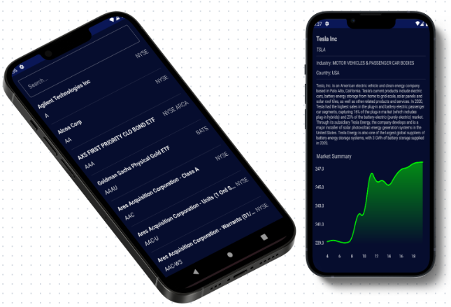

# Stock Market App
The Stock Market App is a powerful tool for staying informed about the latest financial market trends and company information. This app empowers users to make well-informed investment decisions by providing real-time data, company details, and interactive market summaries.

## App Preview

## Features

- Browse and search for companies by name, symbol, and country.
- Company Search: Easily find specific companies by using the powerful search feature. Just type the company name or symbol, and voila - all the information you need at your fingertips!
- Dive into detailed company information, including descriptions and market graphs.
- Stay updated with real-time market data for confident investing.
- User-friendly Jetpack Compose UI for seamless navigation.
- Built with MVVM architecture and Room Database for clean and efficient code.

## Acknowledge

In This App i used:
- Jetpack Compose for the design
- RoomDatabase for Local database & Local Caching
- Clean architecture 
- Api integration with alphavantage Api
- Retrofit for dealing with Api and make http requests

## Contributing

1. Fork it (<https://github.com/tokhy1/StockMarketApp.git/fork>)
2. Create your feature branch (`git checkout -b feature/fooBar`)
3. Commit your changes (`git commit -am 'Add some fooBar'`)
4. Push to the branch (`git push origin feature/fooBar`)
5. Create a new Pull Request

## Contact 
- Email: <mohamed21346587@gmail.com>
- LinkedIn: [LinkedIn Profile](https://www.linkedin.com/in/mohamed-ashraf-abd-elmoneam-409538246?lipi=urn%3Ali%3Apage%3Ad_flagship3_profile_view_base_contact_details%3BgLq%2BPh0QQX62Mwzt3ozQGQ%3D%3D)

Happy Coding!
